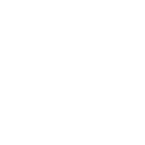

## The Art of Presentation

#### [Serres Meetup](https://www.meetup.com/Serrai-Software-Development-Meetup/)

###### [TheodorosPloumis.com](http://www.theodorosploumis.com/en) / [@theoploumis](http://twitter.com/theoploumis)
________________________

###### Get them: [online presentation](http://theodorosploumis.github.io/art-of-presentation) / [source code](https://github.com/theodorosploumis/art-of-presentation)

###### Under [Attribution 4.0 International](http://creativecommons.org/licenses/by/4.0/) license. Icons by [icons8](https://icons8.com).

---

### What is this talk about

- What to avoid in Presentations
- What are the parameters to consider
- Presentation tips
- Some cases (Hackathon)

---

#### #1
## Time

---

#### #2
## Audience

---

#### #3
## Styling

---

#### #4
## Images vs Text

---

#### #5
## Effects & Animations

---

#### #6
## Slides' number

---

#### #7
## Wifi

---

#### #8
## Live demos

---

#### #9
## The format

---

#### #10
## Speaker notes

---

#### #11
## Rehearsals

---

#### #12
## Tell a story

---

#### #13
## Learn by watching

---

### Thank you!

#### Questions?
